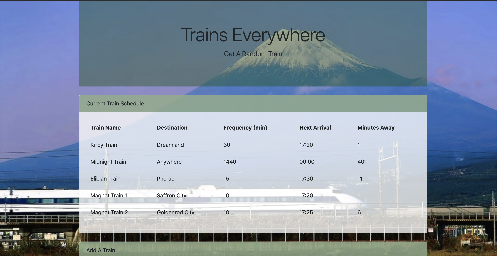

# Train-Scheduler

## Summary

This is "Trains Everywhere", a train timetable using moment.js and Firebase.

## Site Picture



## New Technologies Used

moment.js - This was required to insert time correctly in the application. 

Firebase - Firebase by Google is used to store information a user inputs in the web page. 

## Code Snipit 

This snipit is part of the childSnapshot function which converts the time input by a user into the time of the next train. It also calculates how many more minutes the train will arrive. 

The biggest challenge of creating this application was deciding if the calculation of time should be it's own function or within another function. Eventually putting this snipit within another function was the solution. 

```js

    var frequency = trainFreq;

    var firstTime = trainNext;

    var firstTimeConverted = moment(firstTime, "HH:mm").subtract(1, "years");

    var currentTime = moment();

    var diffTime = moment().diff(moment(firstTimeConverted), "minutes");

    var remainingTime = diffTime % frequency;

    var minutesTillTrain = frequency - remainingTime;

    var nextArrival = moment().add(minutesTillTrain, "minutes").format("HH:mm");
  